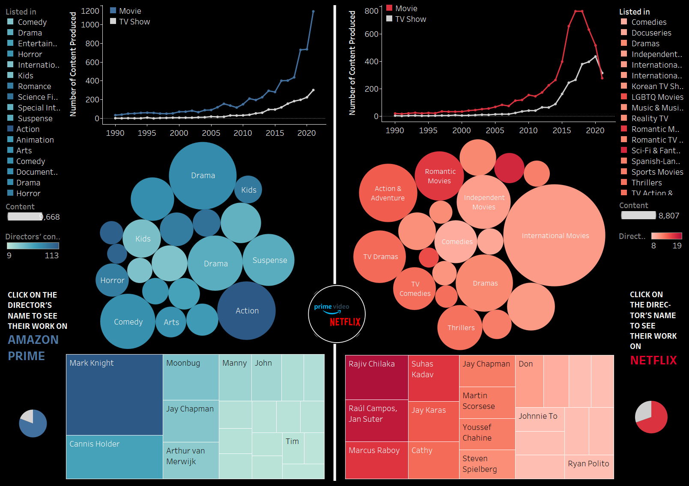
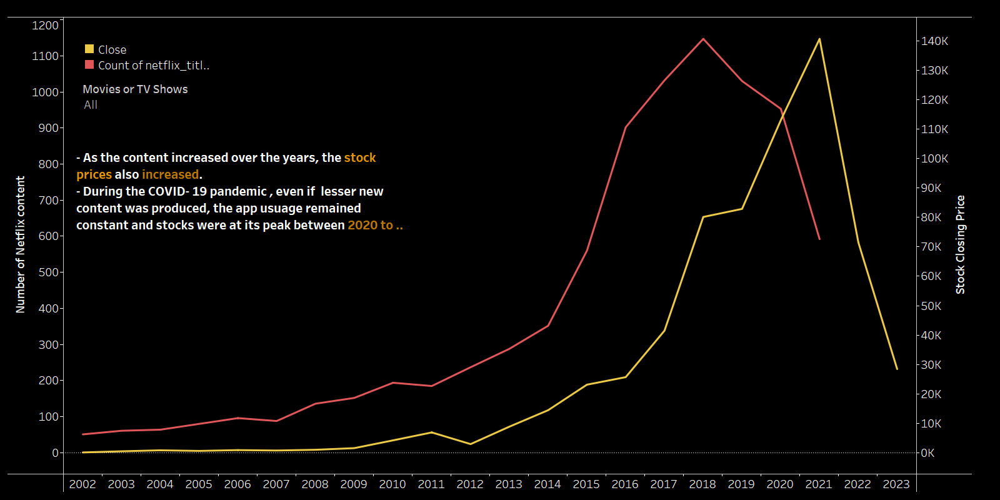
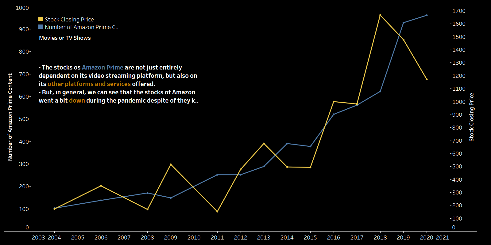

# Analysis of Amazon-Netflix-Performance in Tableau
Link to Tableau file - [Download Visualization Twbx File](visualizations/visual_analysis.twbx)

## Project Objectives:
- Get an overview  of content produced by Netflix and Amazon Prime
-  Reviewing the work of Directors based on genre, content type(movies or TV shows ), and number of shows produced over the years
- Effect of COVID-19 on the amount of content produced and its subsequent effect on the stocks of these companies
  

## NFLX Stock Analysis 

## AMZN Stock Analysis 

## Observations:

- The number of overall content on Amazon Prime is a bit high than Netflix. This is primarily because Netflix focuses on deploying original content. Amazon Prime on the other hand doesn't have major of the content created by them.
- Netflix Popular genres - International Movies, Romantic Movies & TV shows
- Amazon Prime popular genres - Drama, Action, suspense and comedy 
- The amount of content produced on Netflix decreased in the Pandemic years (2019-2020)
- Amazon Prime tried to bring in old movies and TV shows to fight the content block.
  
